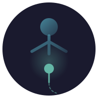

<div align="center">



# empathySync

**Help that knows when to stop.**

*Most chatbots want you to keep talking.*
*This one wants you to leave and go live your life.*

[](LICENSE)
[](#)
[](#)

</div>

## What It Is

An open-source, local-first AI assistant that provides full help for practical tasks but applies restraint on sensitive topics. Everything runs on your machine via Ollama—no cloud APIs, no data harvesting, no telemetry.

## The Philosophy

We optimize for exit, not engagement.

| Practical Tasks | Sensitive Topics |
|-----------------|------------------|
| Writing emails, coding, explanations | Emotional, health, financial, relationships |
| Full assistance, no limits | Brief responses, redirects to humans |
| Complete the task thoroughly | Encourage human connection |

## What Makes It Different

- **Tracks dependency patterns** and warns you if you're relying on it too much
- **Suggests real humans** to talk to instead of continuing the conversation
- **Crisis detection** that redirects to helplines—never engages with crisis content
- **Transparency panel** showing exactly why it responded the way it did
- **Anti-engagement metrics**: fewer sensitive sessions = success
- **Post-crisis protection**: never apologizes for safety interventions

## Quick Start

```bash
# Clone the repository
git clone https://github.com/yourusername/empathySync.git
cd empathySync

# Install dependencies
pip install -r requirements.txt

# Configure environment
cp .env.example .env
# Edit .env with your Ollama settings

# Launch
streamlit run src/app.py
```

### Requirements

- Python 3.8+
- [Ollama](https://ollama.ai/) running locally
- 8GB RAM recommended (4GB minimum)
- GPU optional but improves response time

## Features

### Dual-Mode Intelligence
Full assistance for practical tasks (emails, code, explanations). Restraint on sensitive topics (relationships, finances, health, spirituality).

### Session Intent Check-In
"What brings you here?" helps calibrate responses and detects connection-seeking behavior.

### Emotional Weight Awareness
Recognizes emotionally heavy tasks (resignation emails, difficult conversations) and adds brief human acknowledgment without being therapeutic.

### Trusted Network
Build your list of real humans to reach out to, with pre-written templates for hard conversations.

### Dependency Detection
Monitors usage patterns across sessions. Gently intervenes when over-reliance is detected.

### My Patterns Dashboard
Track your usage—sensitive vs practical. Week-over-week comparisons. The goal: sensitive sessions going *down*.

### "What Would You Tell a Friend?"
For tough decisions, helps you access your own wisdom instead of asking AI for answers.

### Human Connection Gate
"Have you talked to someone about this?" Encourages real human contact before continuing AI conversations on sensitive topics.

### Crisis Intervention
Immediate redirect to professional resources. Never engages with crisis content. Never apologizes for intervening.

## Technical Foundation

- **Local LLM**: Runs entirely on your hardware via Ollama
- **Privacy-First**: Zero external API calls, complete data sovereignty
- **Streamlit UI**: Clean, simple interface
- **YAML-Driven**: All prompts, rules, and thresholds configurable
- **LLM Classification**: Optional intelligent classification for nuanced context detection

## Configuration

See `.env.example` for all configuration options:

```bash
# Required
OLLAMA_HOST=http://localhost:11434
OLLAMA_MODEL=llama2
OLLAMA_TEMPERATURE=0.7

# Optional
LLM_CLASSIFICATION_ENABLED=true  # Enable intelligent classification
STORE_CONVERSATIONS=false        # Local storage only
```

## Project Status

**Core Complete.** All safety systems, dual-mode operation, dependency tracking, human handoff, and transparency features are working.

**Distribution In Progress.** Currently requires technical setup. Working toward easier installation for non-technical users.

See [ROADMAP.md](ROADMAP.md) for detailed implementation status.

## Documentation

- [CLAUDE.md](CLAUDE.md) - Architecture and development guide
- [ROADMAP.md](ROADMAP.md) - Detailed feature implementation plan
- [MANIFESTO.md](MANIFESTO.md) - Design principles and philosophy
- [scenarios/README.md](scenarios/README.md) - Knowledge base editing guide
- [docs/](docs/) - Additional documentation

## Contributing

We welcome contributions from developers who care about digital wellness and ethical AI. See [CONTRIBUTING.md](CONTRIBUTING.md) for guidelines.

## License

MIT License - Built for everyone's benefit and maximum accessibility.

---

*Building technology that serves human flourishing.*

*The goal isn't a better chatbot. It's a world where you need chatbots less.*
